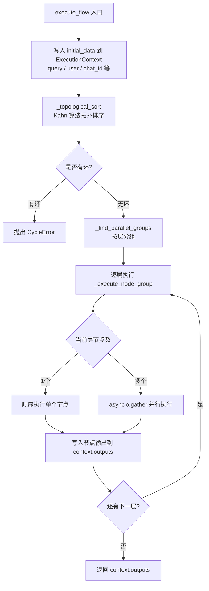

# ApeRAG 检索流程设计

## 概述

ApeRAG 的检索流程采用 **Flow 执行引擎**驱动的多路并行检索架构。用户（或 AI Agent）通过 MCP 工具发起检索请求，请求到达服务端后被转化为一个有向无环图（DAG）描述的检索 Flow，由 Flow 引擎按拓扑顺序并行执行各检索节点，最终将多路结果合并重排后返回。

```mermaid
graph LR
    A[AI Agent / 用户] -->|MCP 工具调用| B[MCP Server]
    B -->|HTTP POST /api/v1/collections/{id}/searches| C[FastAPI 路由]
    C --> D[CollectionService.create_search]
    D --> E[execute_search_flow\n动态构建 DAG]
    E --> F[FlowEngine.execute_flow\nDAG 拓扑排序 + 并行执行]

    F --> G1[vector_search\n向量检索]
    F --> G2[fulltext_search\n全文检索]
    F --> G3[graph_search\n图谱检索]
    F --> G4[summary_search\n摘要检索]
    F --> G5[vision_search\n视觉检索]

    G1 --> H[merge\n多路结果合并]
    G2 --> H
    G3 --> H
    G4 --> H
    G5 --> H

    H --> I[rerank\n结果重排]
    I --> J[SearchResult 返回给调用方]
```

---

## 第一层：MCP 入口

[MCP（Model Context Protocol）](https://modelcontextprotocol.io/) 是 ApeRAG 面向 AI Agent 暴露能力的标准接口。Agent 无需直接调用 REST API，只需调用 MCP 工具即可完成检索。

### MCP 挂载位置

MCP Server 以 Stateless HTTP 模式挂载在 FastAPI 应用的 `/mcp` 路径下：

```python
# aperag/app.py
mcp_app = mcp_server.http_app(path="/", stateless_http=True)
app.mount("/mcp", mcp_app)
```

### `search_collection` 工具

最核心的检索工具是 `search_collection`，它封装了对 REST API 的调用：

```python
# aperag/mcp/server.py
@mcp_server.tool
async def search_collection(
    collection_id: str,
    query: str,
    use_vector_index: bool = True,
    use_fulltext_index: bool = True,
    use_graph_index: bool = True,
    use_summary_index: bool = True,
    use_vision_index: bool = True,
    rerank: bool = True,
    topk: int = 5,
    query_keywords: list[str] = None,
) -> Dict[str, Any]:
    """Search for knowledge in a persistent collection/knowledge base"""
    ...
    async with httpx.AsyncClient(timeout=120.0) as client:
        response = await client.post(
            f"{API_BASE_URL}/api/v1/collections/{collection_id}/searches",
            headers={"Authorization": f"Bearer {api_key}"},
            json=search_data,
        )
```

工具会将参数（启用哪些检索类型、topk、关键词等）组装成 JSON，以 Bearer Token 的方式调用内部 REST API。

> **注意**：`API_BASE_URL` 默认为 `http://localhost:8000`，与 API 进程同机部署时合理。若 MCP 与 API 分离部署，需要通过环境变量或配置覆盖此地址。

---

## 第二层：REST API 端点

MCP 工具调用最终落到以下 FastAPI 路由：

```python
# aperag/views/collections.py
@router.post("/collections/{collection_id}/searches", tags=["search"])
@audit(resource_type="search", api_name="CreateSearch")
async def create_search_view(
    request: Request,
    collection_id: str,
    data: view_models.SearchRequest,
    user: User = Depends(required_user),
) -> view_models.SearchResult:
    return await collection_service.create_search(str(user.id), collection_id, data)
```

### SearchRequest 结构

请求体 `SearchRequest` 对应 OpenAPI schema，字段如下：

| 字段 | 类型 | 说明 |
|------|------|------|
| `query` | string | 用户查询语句 |
| `vector_search` | object | 向量检索参数（`topk`、`similarity`） |
| `fulltext_search` | object | 全文检索参数（`topk`、`keywords`） |
| `graph_search` | object | 图谱检索参数（`topk`） |
| `summary_search` | object | 摘要检索参数（`topk`、`similarity`） |
| `vision_search` | object | 视觉检索参数（`topk`、`similarity`） |
| `rerank` | boolean | 是否对结果重排 |
| `save_to_history` | boolean | 是否保存到搜索历史 |

某个检索类型的字段为 `null`/缺失时，表示本次检索**不启用**该类型。

---

## 第三层：`execute_search_flow` —— 动态构建检索 DAG

`create_search` 校验权限后，调用 `execute_search_flow` 动态构建并执行检索 Flow：

```python
# aperag/service/collection_service.py
async def execute_search_flow(
    self,
    data: view_models.SearchRequest,
    collection_id: str,
    search_user_id: str,
    chat_id: Optional[str] = None,
    flow_name: str = "search",
    flow_title: str = "Search",
) -> Tuple[List[SearchResultItem], str]:
```

### 构建过程

这个方法根据 `SearchRequest` 的内容，**动态**决定要创建哪些节点，再把它们连接成 DAG：

```python
nodes = {}
edges = []
merge_node_id = "merge"

# 按需添加各检索节点
if data.vector_search:
    nodes["vector_search"] = NodeInstance(type="vector_search", ...)
    edges.append(Edge(source="vector_search", target="merge"))

if data.fulltext_search:
    nodes["fulltext_search"] = NodeInstance(type="fulltext_search", ...)
    edges.append(Edge(source="fulltext_search", target="merge"))

if data.graph_search:
    nodes["graph_search"] = NodeInstance(type="graph_search", ...)
    edges.append(Edge(source="graph_search", target="merge"))

# ... summary_search, vision_search 同理

# merge 节点始终存在
nodes["merge"] = NodeInstance(type="merge", ...)

# rerank 节点始终在 merge 之后
nodes["rerank"] = NodeInstance(type="rerank", ...)
edges.append(Edge(source="merge", target="rerank"))
```

构建完成后，将 `FlowInstance` 交给 `FlowEngine` 执行：

```python
flow = FlowInstance(name=flow_name, nodes=nodes, edges=edges)
engine = FlowEngine()
result, _ = await engine.execute_flow(flow, initial_data={"query": query, "user": search_user_id})
```

### 典型 DAG 示意（全部检索类型启用）

```
vector_search ──┐
fulltext_search ─┤
graph_search ────┼──→ merge ──→ rerank ──→ 返回结果
summary_search ──┤
vision_search ───┘
```

检索节点之间**没有依赖关系**，全部指向 `merge`；`merge` 完成后，结果流向 `rerank`。

---

## 第四层：Flow 执行引擎

Flow 引擎（`aperag/flow/engine.py`）是整个检索流程的核心调度组件，负责解析 DAG、拓扑排序、并行执行。

### 核心数据模型

```python
# aperag/flow/base/models.py

class FlowInstance(BaseModel):
    name: str
    title: str
    nodes: Dict[str, NodeInstance]  # node_id -> NodeInstance
    edges: List[Edge]               # 有向边列表

class NodeInstance(BaseModel):
    id: str
    type: str             # 节点类型，对应已注册的 Runner
    input_values: dict    # 节点输入参数（支持 Jinja 模板引用其他节点输出）

class Edge(BaseModel):
    source: str   # 源节点 id
    target: str   # 目标节点 id（target 依赖 source）
```

### 执行流程

`FlowEngine.execute_flow` 的完整执行步骤：



### 拓扑排序：Kahn 算法

```python
def _topological_sort(self, flow: FlowInstance) -> List[str]:
    # 统计每个节点的入度（有多少条边指向它）
    in_degree = {node_id: 0 for node_id in flow.nodes}
    for edge in flow.edges:
        in_degree[edge.target] += 1

    # 从入度为 0 的节点开始（无依赖的节点）
    queue = deque([node_id for node_id, degree in in_degree.items() if degree == 0])

    sorted_nodes = []
    while queue:
        node_id = queue.popleft()
        sorted_nodes.append(node_id)
        # 处理完当前节点后，更新后继节点的入度
        for edge in flow.edges:
            if edge.source == node_id:
                in_degree[edge.target] -= 1
                if in_degree[edge.target] == 0:
                    queue.append(edge.target)

    # 若处理节点数不足，说明图中存在环
    if len(sorted_nodes) != len(flow.nodes):
        raise CycleError("Flow contains cycles")

    return sorted_nodes
```

### 并行分层执行

拓扑排序后，引擎进一步将节点分成**可以并行的层（Level）**：

```python
def _find_parallel_groups(self, flow, sorted_nodes) -> List[Set[str]]:
    """将拓扑序的节点按可并行的层分组"""
    in_degree = {node_id: 0 for node_id in flow.nodes}
    for edge in flow.edges:
        in_degree[edge.target] += 1

    processed = set()
    groups = []

    while len(processed) < len(sorted_nodes):
        # 找出当前所有入度为 0 且未处理的节点 → 可以并行
        current_group = {
            node_id for node_id in sorted_nodes
            if in_degree[node_id] == 0 and node_id not in processed
        }
        groups.append(current_group)
        for node_id in current_group:
            processed.add(node_id)
            for edge in flow.edges:
                if edge.source == node_id:
                    in_degree[edge.target] -= 1

    return groups  # 每个元素是一个 Set，同组内可并行
```

对于默认检索 Flow，分层结果如下：

| 层 | 节点（可并行） |
|----|--------------|
| 第 1 层 | `vector_search`、`fulltext_search`、`graph_search`、`summary_search`、`vision_search` |
| 第 2 层 | `merge`（等待第 1 层全部完成） |
| 第 3 层 | `rerank`（等待 merge 完成） |

同一层内的节点通过 `asyncio.gather` **并发执行**，显著降低多路检索的总延迟。

### 节点间数据传递：Jinja 模板

节点的 `input_values` 支持 Jinja2 模板语法，用于引用其他节点的输出：

```python
# merge 节点引用各检索节点的输出
merge_node_values = {
    "vector_search_docs": "{{ nodes.vector_search.output.docs }}",
    "fulltext_search_docs": "{{ nodes.fulltext_search.output.docs }}",
    "graph_search_docs": "{{ nodes.graph_search.output.docs }}",
    ...
}

# rerank 节点引用 merge 节点的输出
rerank_input_values = {
    "docs": "{{ nodes.merge.output.docs }}",
    ...
}
```

引擎在执行节点前会先解析这些模板，将前序节点的实际输出填充进来。

### NodeRunner 注册机制

每种节点类型通过装饰器注册到全局注册表 `NODE_RUNNER_REGISTRY`：

```python
# aperag/flow/base/models.py
NODE_RUNNER_REGISTRY = {}

def register_node_runner(node_type, input_model, output_model):
    def decorator(cls):
        NODE_RUNNER_REGISTRY[node_type] = {
            "runner": cls(),
            "input_model": input_model,
            "output_model": output_model,
        }
        return cls
    return decorator
```

节点 Runner 示例：

```python
# aperag/flow/runners/vector_search.py
@register_node_runner(
    "vector_search",
    input_model=VectorSearchInput,
    output_model=VectorSearchOutput,
)
class VectorSearchNodeRunner(BaseNodeRunner):
    async def run(self, ui: VectorSearchInput, si: SystemInput) -> Tuple[VectorSearchOutput, dict]:
        ...
```

`import aperag.flow.runners` 时，所有 Runner 模块被加载，完成注册（见 `engine.py` 第 23 行的 `import` 语句）。

---

## 第五层：各检索类型详解

### 1. 向量检索（`vector_search`）

**原理**：将用户查询通过 Embedding 模型转为向量，在向量数据库中做近似最近邻搜索，找出语义最相似的文档片段。

**适用场景**：语义理解类查询，例如"有没有关于性能优化的内容"。

**核心代码**（`aperag/flow/runners/vector_search.py`）：

```python
# 1. 生成查询向量
vector = embedding_model.embed_query(query)

# 2. 在向量数据库中查询
results = context_manager.query(
    query,
    score_threshold=similarity_threshold,
    topk=top_k,
    vector=vector,
    index_types=["vector"],
    chat_id=chat_id,
)

# 3. 标记召回类型
for item in results:
    item.metadata["recall_type"] = "vector_search"
```

**输入参数**：

| 参数 | 说明 | 默认值 |
|------|------|--------|
| `top_k` | 返回结果数量上限 | 5 |
| `similarity_threshold` | 相似度阈值，低于此值的结果过滤掉 | 0.2 |
| `collection_ids` | 检索的知识库 ID 列表 | — |
| `chat_id` | 会话 ID（会话文件检索时用于过滤） | null |

---

### 2. 全文检索（`fulltext_search`）

**原理**：基于关键词的倒排索引检索，支持精确词匹配和布尔查询。

**适用场景**：精确词语查询，例如"找出包含'PostgreSQL'的段落"。

**核心代码**（`aperag/flow/runners/fulltext_search.py`）：

```python
# 支持自定义关键词，或从查询中自动提取
if not keywords:
    keywords = extract_keywords(query)

results = await fulltext_indexer.search(
    index=index_name,
    query=query,
    keywords=keywords,
    topk=top_k,
    chat_id=chat_id,
)
```

**输入参数**：

| 参数 | 说明 | 默认值 |
|------|------|--------|
| `top_k` | 返回结果数量上限 | 5 |
| `keywords` | 自定义关键词列表（可选，不传则从 query 自动提取） | [] |
| `collection_ids` | 检索的知识库 ID 列表 | — |
| `chat_id` | 会话 ID | null |

---

### 3. 图谱检索（`graph_search`）

**原理**：基于知识图谱（Knowledge Graph）的检索。文档在建索引时，LightRAG 会从中提取实体和关系，构建图谱。检索时，在图谱中做 hybrid 模式（向量 + 关键词）的子图查询，返回相关的实体上下文。

**适用场景**：需要多跳推理的查询，例如"张三负责的团队用到了哪些技术栈"。

**前提条件**：知识库必须启用 `enable_knowledge_graph` 选项。

**核心代码**（`aperag/flow/runners/graph_search.py`）：

```python
# 需要集合开启了知识图谱
if not config.enable_knowledge_graph:
    return []

# 创建 LightRAG 实例并查询
rag = await lightrag_manager.create_lightrag_instance(collection)
param = QueryParam(
    mode="hybrid",        # 向量 + 关键词混合查询
    only_need_context=True,  # 只需要图谱上下文，不需要 LLM 生成
    top_k=top_k,
)
context = await rag.aquery_context(query, param=param)
```

**输入参数**：

| 参数 | 说明 | 默认值 |
|------|------|--------|
| `top_k` | 返回结果数量上限 | 5 |
| `collection_ids` | 检索的知识库 ID 列表 | — |

---

### 4. 摘要检索（`summary_search`）

**原理**：每个文档在建索引时会生成文档级别的摘要向量。检索时对摘要向量做近似最近邻搜索，以文档整体粒度召回，适合"找和这个主题相关的文档"类查询。

**适用场景**：需要文档级别召回（而非段落级别）的场景。

**核心代码**（`aperag/flow/runners/summary_search.py`）：

```python
results = context_manager.query(
    query,
    score_threshold=similarity_threshold,
    topk=top_k,
    vector=vector,
    index_types=["summary"],  # 只查摘要索引
    chat_id=chat_id,
)
for item in results:
    item.metadata["recall_type"] = "summary_search"
```

**输入参数**：

| 参数 | 说明 | 默认值 |
|------|------|--------|
| `top_k` | 返回结果数量上限 | 5 |
| `similarity` | 相似度阈值 | 0.2 |
| `collection_ids` | 检索的知识库 ID 列表 | — |

---

### 5. 视觉检索（`vision_search`）

**原理**：基于多模态 Embedding 对图像内容做向量检索。文档中的图片在建索引时会生成视觉向量，支持用自然语言描述来检索相关图片。

**适用场景**：包含大量图表、截图的知识库，例如"找一张关于系统架构的图"。

**输入参数**：

| 参数 | 说明 | 默认值 |
|------|------|--------|
| `top_k` | 返回结果数量上限 | 5 |
| `similarity` | 相似度阈值 | 0.2 |
| `collection_ids` | 检索的知识库 ID 列表 | — |

---

### 6. 合并节点（`merge`）

所有检索节点的结果汇聚到 `merge` 节点：

```python
# aperag/flow/runners/merge.py
@register_node_runner("merge", input_model=MergeInput, output_model=MergeOutput)
class MergeNodeRunner(BaseNodeRunner):
    async def run(self, ui: MergeInput, si: SystemInput):
        # 合并所有检索路的 docs
        all_docs = (
            ui.vector_search_docs
            + ui.fulltext_search_docs
            + ui.graph_search_docs
            + ui.summary_search_docs
            + ui.vision_search_docs
        )

        # 按文本内容去重
        if ui.deduplicate:
            seen = set()
            unique_docs = []
            for doc in all_docs:
                if doc.text not in seen:
                    seen.add(doc.text)
                    unique_docs.append(doc)
            return MergeOutput(docs=unique_docs), {}

        return MergeOutput(docs=all_docs), {}
```

Merge 策略：
- **合并策略（`merge_strategy`）**：目前为 `union`（取并集）
- **去重（`deduplicate`）**：默认开启，按文本内容去重，避免同一段落被多个检索路召回

---

### 7. 重排节点（`rerank`）

Rerank 节点对合并后的文档列表按与查询的相关性重新排序，过滤噪声，提升最终结果质量：

```python
# aperag/flow/runners/rerank.py
@register_node_runner("rerank", input_model=RerankInput, output_model=RerankOutput)
class RerankNodeRunner(BaseNodeRunner):
    async def run(self, ui: RerankInput, si: SystemInput):
        if ui.use_rerank_service:
            # 调用专用 Rerank 模型服务（如 Jina Reranker、Cohere 等）
            rerank_service = RerankService(...)
            docs = await rerank_service.rerank(si.query, ui.docs)
        else:
            # 降级策略：按原始召回分数排序
            docs = sorted(ui.docs, key=lambda d: d.score, reverse=True)
        return RerankOutput(docs=docs), {}
```

Rerank 行为由 `SearchRequest.rerank` 字段控制：
- `rerank=true`：尝试调用用户配置的 Rerank 模型服务；若未配置，降级为按分数排序
- `rerank=false`：直接按合并后的召回分数排序

---

## 检索结果

流程执行完成后，`rerank` 节点的输出 `docs` 被转换为 `SearchResultItem` 列表：

```python
for idx, doc in enumerate(docs):
    items.append(SearchResultItem(
        rank=idx + 1,
        score=doc.score,
        content=doc.text,
        source=doc.metadata.get("source", ""),
        recall_type=doc.metadata.get("recall_type", ""),  # 标明来自哪种检索
        metadata=doc.metadata,
    ))
```

`recall_type` 字段枚举值：

| 值 | 含义 |
|----|------|
| `vector_search` | 来自向量检索 |
| `fulltext_search` | 来自全文检索 |
| `graph_search` | 来自图谱检索 |
| `summary_search` | 来自摘要检索 |
| `vision_search` | 来自视觉检索 |

---

## 会话文件检索

`execute_search_flow` 也被复用于会话（Chat）内的临时文件检索，入口为：

```
POST /api/v1/chats/{chat_id}/search
```

区别在于传入了 `chat_id` 参数，各检索节点会利用该参数过滤，只检索属于该会话的上传文件，不会混入知识库的全局文档。

---

## 关键文件索引

| 文件 | 职责 |
|------|------|
| `aperag/mcp/server.py` | MCP 工具定义，`search_collection` 入口 |
| `aperag/app.py` | FastAPI 应用，MCP 挂载点 |
| `aperag/views/collections.py` | REST API 路由 `/collections/{id}/searches` |
| `aperag/service/collection_service.py` | `create_search` 和 `execute_search_flow` 实现 |
| `aperag/flow/engine.py` | Flow 执行引擎，拓扑排序与并行调度 |
| `aperag/flow/base/models.py` | DAG 数据模型，NodeRunner 注册机制 |
| `aperag/flow/runners/vector_search.py` | 向量检索 Runner |
| `aperag/flow/runners/fulltext_search.py` | 全文检索 Runner |
| `aperag/flow/runners/graph_search.py` | 图谱检索 Runner（基于 LightRAG） |
| `aperag/flow/runners/summary_search.py` | 摘要检索 Runner |
| `aperag/flow/runners/vision_search.py` | 视觉检索 Runner |
| `aperag/flow/runners/merge.py` | 多路结果合并 Runner |
| `aperag/flow/runners/rerank.py` | 结果重排 Runner |

---

## 相关文档

- [索引链路架构设计](./indexing_architecture.md)：了解各检索类型的索引是如何构建的
- [图索引构建流程](./graph_index_creation.md)：深入了解知识图谱的构建过程
- [MCP API 集成指南](../integration/mcp-api.md)：如何在 Agent 中接入 ApeRAG 的 MCP 工具
